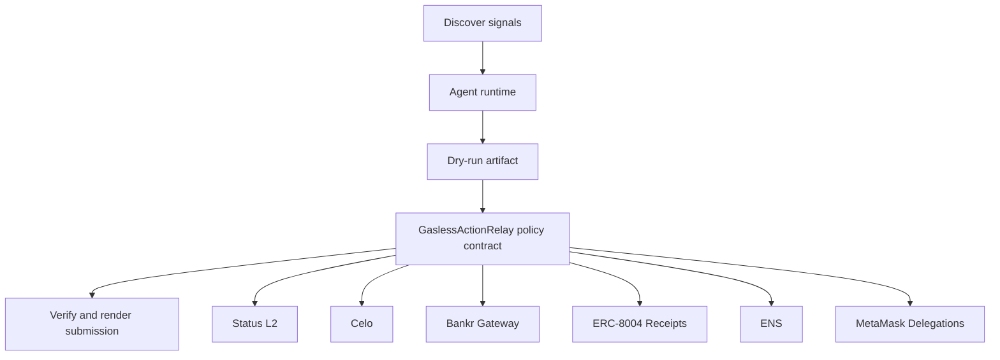

# Gasless Field Runner

- **Repo:** `Synthesis-StatusL2`
- **Primary track:** Status L2 Go Gasless
- **Category:** gasless
- **Submission status:** implementation ready, waiting for credentials and TxIDs.

A gasless-first action relay that assembles execution bundles and proofs suitable for Status L2 Sepolia while keeping live relayer wiring optional.

## Selected concept

A gasless-first loop builds action bundles and settlement proofs suitable for Status L2 Sepolia. The controller contract stores nonce, operator, and policy state while local scripts keep live execution disabled until an actual relayer and wallet are attached.

## Idea shortlist

1. Gasless Autonomous Trader
2. Zero-Gas Deployment Bot
3. Messaging-Native Action Feed

## Partners covered

Status L2, Celo, Bankr Gateway, ERC-8004 Receipts, ENS, MetaMask Delegations

## Architecture



## Repository layout

- `src/`: shared policy contracts plus the repo-specific wrapper contract.
- `script/`: Foundry deployment entrypoint.
- `agents/`: Python runtime, partner adapters, and project metadata.
- `scripts/`: CLI utilities for running the loop and rendering submissions.
- `docs/`: architecture, credentials, demo script, and security notes.
- `submissions/`: generated `synthesis.md` snippet for this repo.

## Action catalog

| Action | Partner | Purpose | Max USD | Sensitivity |
| --- | --- | --- | --- | --- |
| `status_l2_gasless_bundle` | Status L2 | Use Status L2 for a bounded action in this repo. | $8 | medium |
| `celo_payment_settle` | Celo | Use Celo for a bounded action in this repo. | $150 | low |
| `bankr_gateway_compute_route` | Bankr Gateway | Use Bankr Gateway for a bounded action in this repo. | $10 | high |
| `erc_8004_receipts_receipt_anchor` | ERC-8004 Receipts | Use ERC-8004 Receipts for a bounded action in this repo. | $1 | medium |
| `ens_ens_publish` | ENS | Use ENS for a bounded action in this repo. | $5 | low |
| `metamask_delegations_delegate_scope` | MetaMask Delegations | Use MetaMask Delegations for a bounded action in this repo. | $2 | high |

## Commands

```bash
python3 -m unittest discover -s tests
forge test
python3 scripts/run_agent.py
python3 scripts/plan_live_demo.py
python3 scripts/render_submission.py
```

## Credentials

| Partner | Variables | Docs |
| --- | --- | --- |
| Status L2 | STATUS_RPC_URL, STATUS_RELAYER_URL | https://status.app/ |
| Celo | CELO_RPC_URL | https://docs.celo.org/ |
| Bankr Gateway | BANKR_API_KEY, BANKR_CHAT_COMPLETIONS_URL, BANKR_MODEL | https://bankr.bot/ |
| ERC-8004 Receipts | RPC_URL | https://eips.ethereum.org/EIPS/eip-8004 |
| ENS | ENS_NAME | https://docs.ens.domains/ |
| MetaMask Delegations | RPC_URL | https://docs.metamask.io/delegation-toolkit/ |

## Live demo plan

1. Copy .env.example to .env and fill the required keys.
2. Deploy the contract with forge script script/Deploy.s.sol --broadcast for GaslessActionRelay.
3. Run python3 scripts/run_agent.py to produce a dry run for status_field_runner.
4. Set LIVE_MODE=true and rerun python3 scripts/run_agent.py with real credentials.
5. Run python3 scripts/render_submission.py and attach TxIDs plus repo links.
