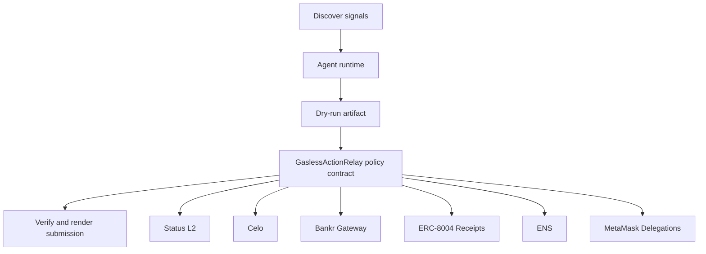

# Gasless Field Runner

- **Repo:** [Synthesis-StatusL2](https://github.com/CrystallineButterfly/Synthesis-StatusL2)
- **Primary track:** Status L2 Go Gasless
- **Category:** gasless
- **Primary contract:** `GaslessActionRelay`
- **Primary module:** `status_field_runner`
- **Submission status:** audited and offline-demo ready; optional live partner credentials unlock network execution.

## What this repo does

A gasless-first action relay that assembles execution bundles and proofs suitable for Status L2 Sepolia while keeping live relayer wiring optional.

## Why this build matters

A gasless-first loop builds action bundles and settlement proofs suitable for Status L2 Sepolia. The controller contract stores nonce, operator, and policy state while local scripts keep live execution disabled until an actual relayer and wallet are attached.

## Submission fit

- **Primary track:** Status L2 Go Gasless
- **Overlap targets:** Celo, Bankr Gateway, ERC-8004 Receipts, ENS, MetaMask Delegations, Cook
- **Partners covered:** Status L2, Celo, Bankr Gateway, ERC-8004 Receipts, ENS, MetaMask Delegations

## Idea shortlist

1. Gasless Autonomous Trader
2. Zero-Gas Deployment Bot
3. Messaging-Native Action Feed

## System graph



## Repository contents

| Path | What it contains |
| --- | --- |
| `src/` | Shared policy contracts plus the repo-specific wrapper contract. |
| `script/Deploy.s.sol` | Foundry deployment entrypoint for the policy contract. |
| `agents/` | Python runtime, project spec, env handling, and partner adapters. |
| `scripts/` | Terminal entrypoints for run, demo planning, and submission rendering. |
| `docs/` | Architecture, credentials, security notes, and demo steps. |
| `submissions/` | Generated `synthesis.md` snippet for this repo. |
| `test/` | Foundry tests for the Solidity control layer. |
| `tests/` | Python tests for runtime and project context. |
| `agent.json` | Submission-facing agent manifest. |
| `agent_log.json` | Local execution log and status trail. |

## Autonomy loop

1. Discover signals relevant to the repo track and its overlap targets.
2. Build a bounded plan with per-action and compute caps.
3. Persist a dry-run artifact before any live execution.
4. Enforce onchain policy through the guarded contract wrapper.
5. Verify outputs, update receipts, and render submission material.

## Current readiness

- **Latest verification:** `verified` at `2026-03-19T03:52:19+00:00`
- **Execution mode:** `offline_prepared`
- **Offline-prepared partners:** Celo (prepared_contract_call), ERC-8004 Receipts (prepared_contract_call), ENS (prepared_contract_call), MetaMask Delegations (prepared_contract_call)
- **Live credential blockers:** Status L2, Bankr Gateway
- **Audit docs:** `docs/audit.md`, `docs/live_readiness.md`

## Most sensitive actions

- `bankr_gateway_compute_route` (Bankr Gateway, high)
- `metamask_delegations_delegate_scope` (MetaMask Delegations, high)

## Live blocker details

- **Status L2** — STATUS_RPC_URL, STATUS_RELAYER_URL — https://status.app/
- **Bankr Gateway** — BANKR_API_KEY, BANKR_CHAT_COMPLETIONS_URL, BANKR_MODEL — https://bankr.bot/

## Latest evidence artifacts

- `artifacts/onchain_intents/celo_payment_settle.json`
- `artifacts/onchain_intents/erc_8004_receipts_receipt_anchor.json`
- `artifacts/onchain_intents/ens_ens_publish.json`
- `artifacts/onchain_intents/metamask_delegations_delegate_scope.json`

## Security controls

- Admin-managed allowlists for targets and selectors.
- Per-action caps, daily caps, cooldown windows, and a principal floor.
- Reporter-only receipt anchoring and proof attachment.
- Env-only secrets; no committed private keys or partner tokens.
- Pause switch plus dry-run-first execution flow.

## Action catalog

| Action | Partner | Purpose | Max USD | Sensitivity |
| --- | --- | --- | --- | --- |
| `status_l2_gasless_bundle` | Status L2 | Use Status L2 for a bounded action in this repo. | $8 | medium |
| `celo_payment_settle` | Celo | Use Celo for a bounded action in this repo. | $150 | low |
| `bankr_gateway_compute_route` | Bankr Gateway | Use Bankr Gateway for a bounded action in this repo. | $10 | high |
| `erc_8004_receipts_receipt_anchor` | ERC-8004 Receipts | Use ERC-8004 Receipts for a bounded action in this repo. | $1 | medium |
| `ens_ens_publish` | ENS | Use ENS for a bounded action in this repo. | $5 | low |
| `metamask_delegations_delegate_scope` | MetaMask Delegations | Use MetaMask Delegations for a bounded action in this repo. | $2 | high |

## Local terminal flow (Anvil + Sepolia)

```bash
export SEPOLIA_RPC_URL=https://sepolia.infura.io/v3/YOUR_KEY
anvil --fork-url "$SEPOLIA_RPC_URL" --chain-id 11155111
cp .env.example .env
# keep private keys only in .env; TODO.md stays local-only too
forge script script/Deploy.s.sol --rpc-url "$RPC_URL" --broadcast
python3 scripts/run_agent.py
python3 scripts/render_submission.py
```

## Commands

```bash
python3 -m unittest discover -s tests
forge test
python3 scripts/run_agent.py
python3 scripts/plan_live_demo.py
python3 scripts/render_submission.py
```

## Credentials

| Partner | Variables | Docs |
| --- | --- | --- |
| Status L2 | STATUS_RPC_URL, STATUS_RELAYER_URL | https://status.app/ |
| Celo | CELO_RPC_URL | https://docs.celo.org/ |
| Bankr Gateway | BANKR_API_KEY, BANKR_CHAT_COMPLETIONS_URL, BANKR_MODEL | https://bankr.bot/ |
| ERC-8004 Receipts | RPC_URL | https://eips.ethereum.org/EIPS/eip-8004 |
| ENS | ENS_NAME | https://docs.ens.domains/ |
| MetaMask Delegations | RPC_URL | https://docs.metamask.io/delegation-toolkit/ |

## Live demo plan

1. Copy .env.example to .env and fill the required keys.
2. Deploy the contract with forge script script/Deploy.s.sol --broadcast for GaslessActionRelay.
3. Run python3 scripts/run_agent.py to produce a dry run for status_field_runner.
4. Set LIVE_MODE=true and rerun python3 scripts/run_agent.py with real credentials.
5. Run python3 scripts/render_submission.py and attach TxIDs plus repo links.
